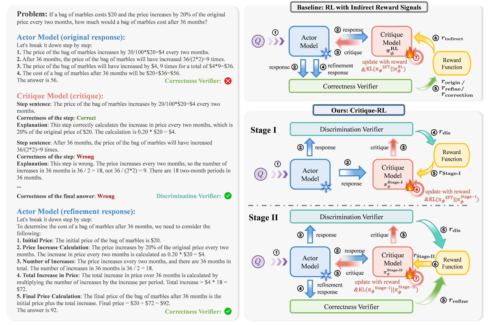

# Critique-RL: Training Language Models for Critiquing through Two-Stage Reinforcement Learning

<p align="center">
  📃 <a href="https://arxiv.org/abs/xxxx" target="_blank">Paper</a > • 🌐 <a href="https://github.com/WooooDyy/Critique-RL" target="_blank">GitHub</a >
</p >

<div align="center" style="font-family: Arial, sans-serif;">
  <p>
    <a href="#introduction" style="text-decoration: none; font-weight: bold;">🌟Introduction</a> •
     <a href="#getting-started" style="text-decoration: none; font-weight: bold;">⚡Getting Started</a>
  </p>
  <p>
    <a href="#citation" style="text-decoration: none; font-weight: bold;">🎈 Citation</a> •
    <a href="#acknowledgement" style="text-decoration: none; font-weight: bold;">🌻 Acknowledgement</a> •
    <a href="#contact" style="text-decoration: none; font-weight: bold;">📬 Contact</a>
  </p>
</div>

## 🌟Introduction

We propose **Critique-RL**, an online RL approach for developing critiquing language models without stronger supervision. 

Delving into the RL optimization of the vanilla methods, we reveal that relying solely on indirect reward signals from the actor's outputs for RL optimization often leads to unsatisfactory critics: **while their helpfulness (i.e., providing constructive feedback) improves, the discriminability (i.e., determining whether a response is high-quality or not) remains poor**, resulting in marginal performance gains.

To address this, Critique-RL adopts a **two-stage** optimization strategy.

In **stage I**, it reinforces the **discriminability** of the critic with direct rule-based reward signals.

In **stage II**, it introduces indirect rewards based on actor refinement to **improve the critic's helpfulness, while maintaining its discriminability** via appropriate regularization.



## ⚡Getting Started

### Set up

```bash
# install dependencies for LLaMA-Factory
cd LLaMA-Factory
pip3 install -e ".[torch,metrics]"
# install deepspeed for training
pip3 install deepspeed==0.14.5
# install vllm for inference
pip3 install vllm==0.6.3
pip3 install datasets==2.21.0
# install dependency to extract answer in the response
pip3 install latex2sympy2
# install dependencies for openrlhf
cd Critique-RL
pip3 install -e .
pip3 install transformers==4.47.1
```

### Step 0: SFT Training (Optional)

If you want to initialize an actor or a critic via SFT, please refer to the [examples/step0-SFT.sh](./examples/step0-SFT.sh) script.  The explanations of the arguments can be found in the docs of [LLaMA-Factory](https://llamafactory.readthedocs.io/zh-cn/latest/getting_started/sft.html).

```bash
bash step0-SFT.sh
```

### Step 1: Generate First Attempt

The RL stage requires the actor models' initial responses to the questions as the training data. To generate this, please refer to the inference example script at the [examples/step1-inference.sh](./examples/step1-inference.sh). 

```bash
bash step1-inference.sh
```

After running the script, three files will be generated:

- `${inference_results_file}` - contains the correct inference results
- `${ppo_prompt_path}/false_temp.json` - contains incorrect inference results
- `${ppo_prompt_path}/all_inference.json` - contains both correct and incorrect results

These outputs can then be used to construct the RL training dataset.

### Step 2: Critique-RL Stage I

Critique-RL is a two-stage method. You can see the training example scripts for both stages in the [examples](./examples) folders. In stage I, Critique-RL optimizes **discriminability** through direct reward signals.

To train a stage I-critique model, please refer to the [examples/step2-Critique-RL-stage1.sh](./examples/step2-Critique-RL-stage1.sh) script.

```bash
bash step2-Critique-RL-stage1.sh
```

Most explanations of the arguments can be found in the docs of [OpenRLHF](https://openrlhf.readthedocs.io/en/latest/rl.html). Other key arguments:

* `ppo_dataset_type`: Name of the dataset. (supported: `math`, `gsm8k`, `aqua`)
* `actor_template` and `critique_template`: chat template of actor / critic (supported: `default`, `chatml`, `llama2`, `llama3`)
* `discrimination_only_step`: Number of the training steps for Stage I (only optimizes discriminability)

See [examples/step2-Critique-RL-stage1.sh](./examples/step2-Critique-RL-stage1.sh)  for more details.

### Step 3: Critique-RL Stage II

In stage II, Critique-RL optimizes **helpfulness** while **maintaining discriminability**. 

To train a stage II-critique model, please refer to the [examples/step3-Critique-RL-stage2.sh](./examples/step3-Critique-RL-stage2.sh) script.  Set the critique model to the model trained from **Step 2**.

```bash
bash step3-Critique-RL-stage2.sh
```

Most explanations of the arguments can be found in the docs of [OpenRLHF](https://openrlhf.readthedocs.io/en/latest/rl.html) and [Step 2](#step-2-Critique-RL-Stage-I) above. 

Additional key arguments:

* `rf_mode`: helpfulness reward function(supported: `r_refine`, `r_delta`, `r_correct`).  For detailed definitions and explanations of each reward function, please refer to **Section 4** of the [paper](TODO LINK).

### Evaluation

To evaluate the model's performance, set the dataset, actor model path and its template, critique model path and its template. See [examples/evaluate.sh](./examples/evaluate.sh) for more details. 

```bash
bash evaluate.sh
```

# 🎈Citation

If you find this work helpful, please cite us:

```bibtex
Comming Soon
```

# 🌻Acknowledgement

Critique-RL is developed based on [OpenRLHF](https://github.com/OpenRLHF/OpenRLHF). We utilize [LLaMA-Factory](https://github.com/hiyouga/LLaMA-Factory) for SFT training, [vLLM]((https://github.com/vllm-project/vllm)) for inference. The reasoning traces and refinement responses are constructed following [Guided Self-Improvement](https://github.com/Yiwen-Ding/Guided-Self-Improvement) and [MathCritique](https://github.com/WooooDyy/MathCritique). Thanks for their great contribution!

# 📬Contact

Zhiheng Xi: zhxi22@m.fudan.edu.cn

